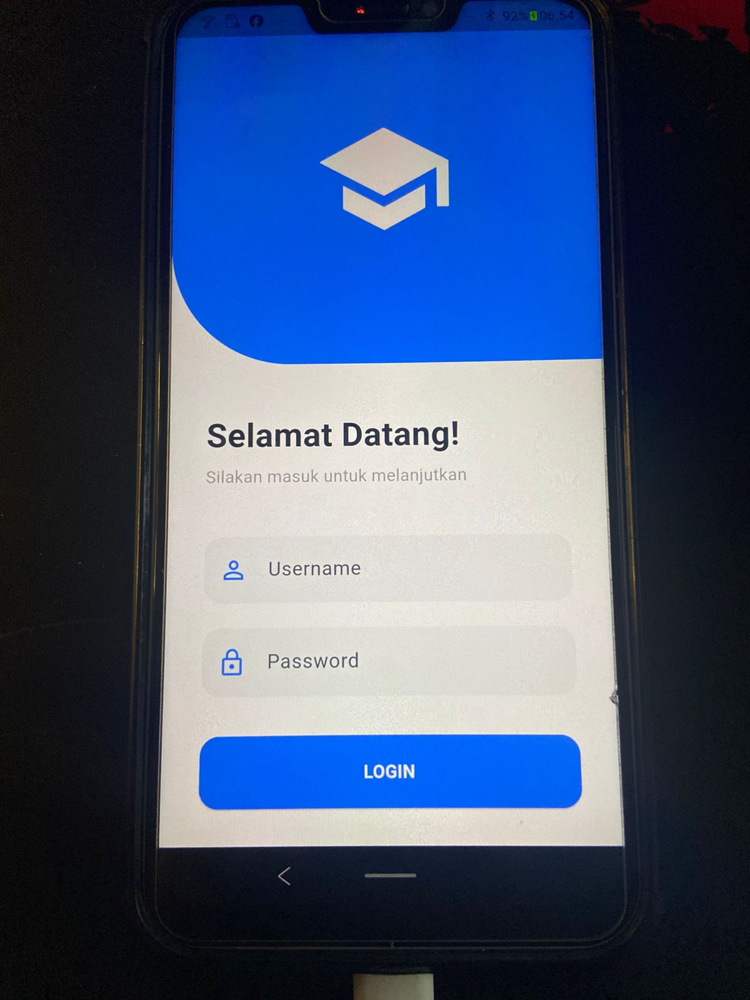
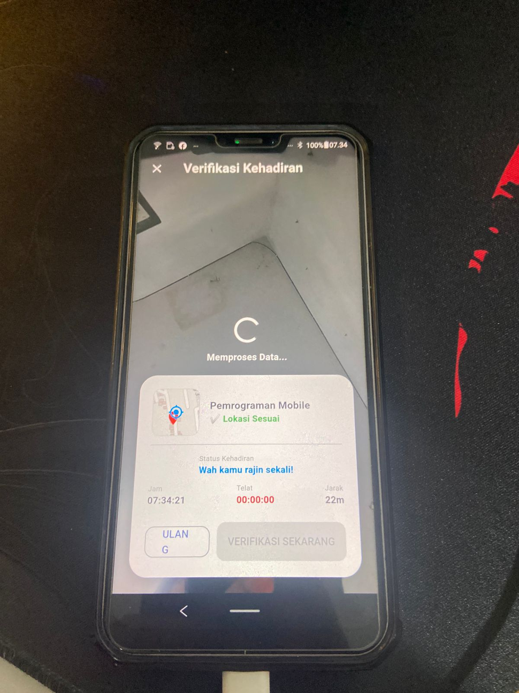
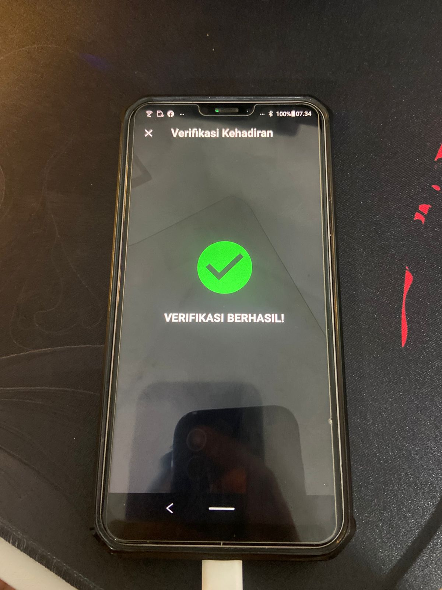

# Absenku - Smart Attendance System 🎓
  

**Absenku** adalah aplikasi presensi mahasiswa berbasis mobile yang mengintegrasikan teknologi **Geofencing** dan **Biometric Photo Verification** untuk memastikan validitas kehadiran mahasiswa di lokasi perkuliahan.

---

## 🚀 Fitur Utama

* **Custom Authentication 🔐**: Sistem login dan registrasi mahasiswa menggunakan tabel database PostgreSQL kustom di Supabase.
* **Geofencing Verification 📍**: Deteksi lokasi real-time dengan penghitungan jarak (radius) antara posisi mahasiswa dan titik koordinat kelas.
* **Photo Proof 📸**: Pengambilan foto bukti kehadiran langsung melalui kamera aplikasi untuk menghindari kecurangan.
* **Supabase Storage Integration ☁️**: Foto bukti absen otomatis diunggah ke Supabase Storage secara terorganisir.
* **Attendance History 🗓️**: Riwayat presensi lengkap yang tersinkronisasi otomatis menggunakan Database Triggers untuk transparansi data.
* **Status Otomatis**: Penentuan status kehadiran ("Hadir" atau "Di luar radius") berdasarkan validasi lokasi sistem.

---

## 🛠️ Teknologi

Aplikasi ini menggunakan stack teknologi modern:

* **Flutter & Dart**: Framework utama untuk pengembangan Cross-Platform.
* **Supabase**: Backend-as-a-Service (BaaS) untuk database PostgreSQL, Storage, dan RLS (Row Level Security).
* **Geolocator**: Untuk mendapatkan koordinat presisi (latitude & longitude) mahasiswa.
* **Camera API**: Untuk pengambilan foto verifikasi langsung dari perangkat.
* **PostgreSQL Triggers**: Logika database untuk otomatisasi sinkronisasi data ke tabel riwayat.

---

## 📸 Screenshot (Preview)

| Halaman Login | Beranda / Mata Kuliah | Verifikasi Lokasi | Riwayat Absen | verfikasi berhasil |
| :---: | :---: | :---: | :---: | :---: |
|  |  |  |  |  |

> *Catatan: Ganti gambar di atas dengan screenshot asli aplikasi Anda setelah aplikasi dijalankan.*

---

## 📸 Rancangan Arsitektur Sistem

| activity Diagram | Squence diagram | Diagram class |
| :---: | :---: | :---: |
|  |  |  | 

---
## 🔗 Link Penting

* **Figma Design**: [Lihat Desain di Figma:](https://www.figma.com/design/26JmEhNEQy0RbxPUsktjny/ABSENKU?node-id=0-1&t=4IWi59aBfiSIZ6xk-1)

---

## 📜 Lisensi

Lisensi **MIT License** © 2026 **SUGIX**

